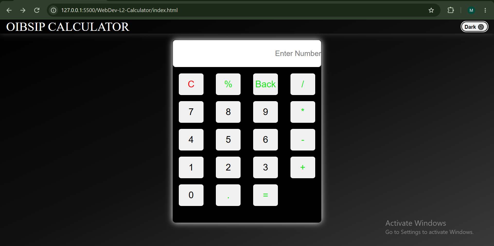
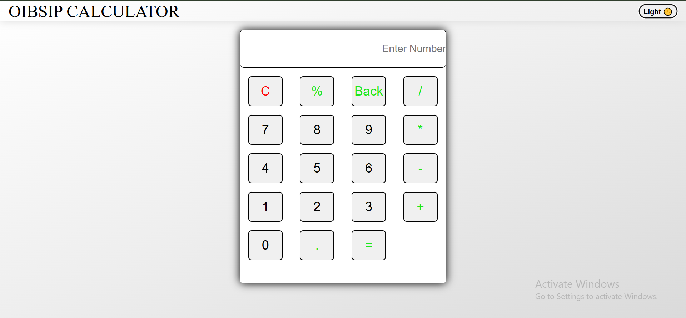

# 🧮 OIBSIP Calculator

A simple and responsive calculator built using HTML, CSS, and JavaScript as part of the Oasis Infobyte Web Development Internship (Level-2 Project).

## 🚀 Features

- Basic Arithmetic Operations
  - Addition (+)
  - Subtraction (-)
  - Multiplication (*)
  - Division (/)
  - Modulus (%)

- Dark / Light Theme Toggle
- Responsive Design
- Input Validation
- Backspace Functionality
- Clear Screen Functionality
- Error Handling
- Animated Navbar Title
- Local Storage Theme Persistence

---

## 📂 Project Structure

```
OIBSIP-Calculator/
│
├── index.html
├── style.css
├── script.js
└── README.md
```

---

## 🛠️ Technologies Used

- HTML5
- CSS3
- JavaScript (ES6)

---

## ✨ Functionalities

### Number Input

Users can enter numbers using calculator buttons.

### Operator Validation

The calculator prevents:

- Starting an expression with operators
- Multiple operators together
- Invalid expressions

Example:

```
12++5 ❌
12+-5 ❌
```

---

### Backspace

Removes the last entered character.

Example:

```
1234
↓
Back
↓
123
```

---

### Clear Button

Clears the entire display.

Example:

```
123+45
↓
C
↓
Empty Screen
```

---

### Error Handling

Displays "Error" for invalid calculations.

Examples:

```
10/0
→ Error

0/0
→ Error
```

---

### Theme Toggle

Switch between:

- 🌑 Dark Mode
- 🌕 Light Mode

The selected theme is stored using Local Storage.

---

## 📱 Responsive Design

The calculator is designed to work smoothly on:

- Desktop
- Tablet
- Mobile Devices

---

## 🎯 Internship Task

This project was developed as a Level-2 task for the Oasis Infobyte Web Development Internship Program.

---

## 📸 Preview





```
images/
├── calculator-dark.png
├── calculator-light.png
```

---

## 🔗 Author

Muskan

GitHub: https://github.com/Muskan-goyal-293/OIBSIP.git

LinkedIn: https://muskan-goyal-293.github.io/OIBSIP/WebDev-L2-Calculator/

---

## ⭐ Project Status

✅ Completed
