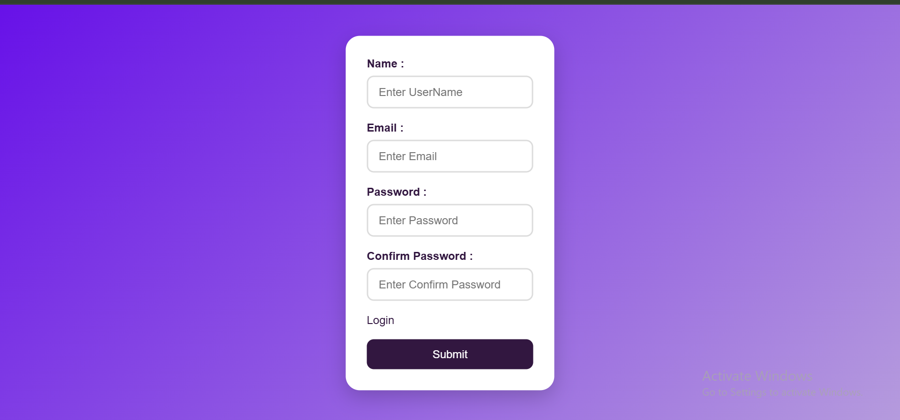
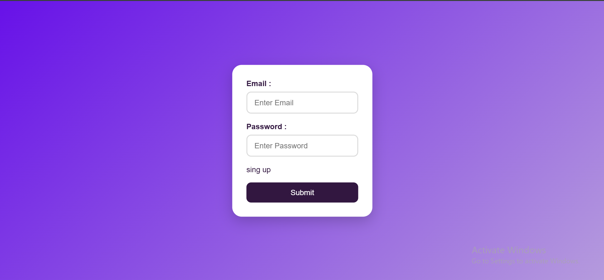

# 🔐 Login Authentication System

A responsive Login Authentication System built using HTML, CSS, and JavaScript. The project allows users to create an account, log in with their credentials, access a  dashboard, and securely log out using Local Storage for client-side authentication.

## 🚀 Features

* User Registration (Sign Up)
* User Login Authentication
* Form Validation
* Email Validation
* Password Validation
* Confirm Password Verification
* Protected Dashboard Access
* Logout Functionality
* Local Storage Data Management
* Responsive Design

## 🛠️ Technologies Used

* HTML5
* CSS3
* JavaScript (ES6)
* Local Storage API

## 📂 Project Structure

```text
Login-Authentication-System/
│
| index.html
│ style.css
│ script.js
│
└── images/
      │-- backgroundImage.jpg
      │-- heroSectionImg.webp
      │-- logo.webp

```

## ⚙️ How It Works

### Sign Up

* User enters username, email, password, and confirm password.
* Form validation checks all inputs.
* User information is stored in Local Storage.

### Login

* User enters registered email and password.
* Credentials are verified against stored data.
* Successful authentication redirects the user to the dashboard.

### Dashboard

* Accessible only after successful login.
* Includes logout functionality.

### Logout

* Removes the login session from Local Storage.
* Redirects the user back to the login page.

## 📸 Screenshots

Add screenshots of:

1. Sign Up Page
2. Login Page
3. Dashboard Page





## 🎯 Learning Outcomes

* DOM Manipulation
* Event Handling
* Form Validation
* Local Storage Management
* Authentication Flow
* Responsive Web Design
* JavaScript Logic Building

## 👨‍💻 Author

Muskan

## 📄 License

This project is created for learning and portfolio purposes.
